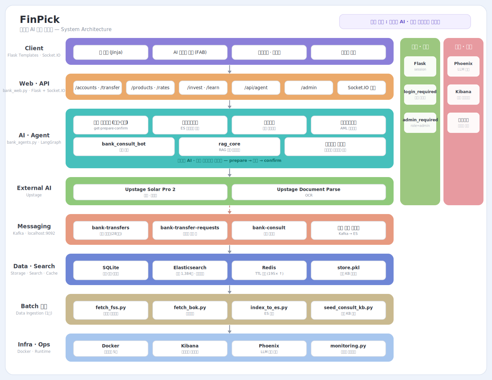

# FinPick — 대화형 AI 은행 서비스

> 메뉴를 찾아다니는 대신 **"○○에게 5만원 보내줘"** 라고 말하면 처리되는 은행.
> 단, 돈이 오가는 일은 AI가 임의로 실행하지 않고 **사용자 확인을 받은 뒤 실행**합니다.

RAG 챗봇과 LangGraph 멀티에이전트로 은행 업무를 대화로 처리하는 개인 프로젝트입니다.
계좌·이체·상품 비교부터 이상거래탐지·여신심사·컴플라이언스까지, 실제 은행 업무 흐름을 담았습니다.

---

## 왜 만들었나 (문제 정의)

기존 은행 앱은 **"이체하려면 어느 메뉴로 들어가야 하지"** 라는 탐색 부담이 큽니다.
FinPick은 이 불편을 대화형 인터페이스로 재정의했습니다. 다만 금융은 실수가 곧 손실이므로,
**"판단은 AI가, 실행 결정권은 사용자가"** 라는 원칙을 세웠습니다.

- AI가 "홍길동님에게 50,000원을 이체합니다. 진행할까요?" 라고 **요약·확인**을 먼저 제시
- 사용자가 "네"라고 확인해야만 실제 이체 실행 (`prepare → confirm` 게이트)
- 이 설계는 이전 프로젝트(하루한끼)의 **"판정은 Rule, 설명은 LLM"** 원칙을 금융 도메인에 적용한 것입니다.

---

## 핵심 특징

| 항목 | 내용 |
|---|---|
| **AI 은행원** | LangGraph로 **5개 업무 도메인**(계좌거래·상담·이상거래탐지·여신심사·컴플라이언스)을 **에이전트 4개**로 구현 — 고객 에이전트가 계좌거래·상담을 겸함 |
| **안전 게이트** | 이체·포인트 전환 등 금전 작업은 **실행 전 사용자 확인 필수** |
| **상품 데이터** | 금융감독원 공시 예적금·대출 **1,384건**을 Elasticsearch에 색인, 금리 비교·대시보드 |
| **감사·모니터링** | 이체 이벤트 **28개 항목**을 표준화 → Kafka → ES 색인 → Kibana 이상거래 모니터링 |
| **운영 도구** | 상담 유형별 프롬프트·변수를 편집하는 **관리자 프롬프트 매니저** (비개발자도 톤 조정 가능) |

---

## 시스템 아키텍처



> Client → Web/API → AI·Agent → Upstage → Messaging(Kafka) → Data → Batch적재 → Infra의 계층 흐름.
> 오른쪽은 크로스컷(인증·세션 / 관측·운영), 상단은 핵심 원칙(**판단은 AI · 실행 결정권은 사용자**).
> 다이어그램 생성 스크립트: [`docs/make_architecture.py`](docs/make_architecture.py)

---

## 기술 스택

- **Backend** · Python (Flask), Socket.IO
- **AI / Agent** · LangGraph 멀티에이전트, Upstage Solar Pro 2, RAG(임베딩 검색)
- **Data / Search** · Elasticsearch (상품·이체 로그 색인), Redis (TTL 캐시), SQLite
- **Messaging** · Kafka (비동기 이체 큐 + 이벤트 감사로그)
- **Ops / Observability** · Docker, Kibana (이상거래 모니터링), Phoenix (LLM 호출 추적)

---

## 성능 측정 · 아키텍처 의사결정

상품 검색(RAG)은 **4개 구조(메모리 numpy · ES 키워드 · ES 의미검색 · +Redis 캐시)를 같은 데이터(1,384건)로 측정 비교**한 뒤 설계했습니다. 병목을 먼저 찾고, 그 지점을 겨냥한 캐시만 붙였습니다.

| 구성 (의미검색 end-to-end) | 평균 응답시간 |
|---|--:|
| 캐시 미적용 | 471.3 ms |
| **캐시 히트** | **2.4 ms  → 약 195배 향상** |

> 병목은 검색이 아니라 **질문 임베딩(Upstage) 호출 평균 325ms** 였고, 이를 Redis 캐시로 제거했습니다. recall@5는 키워드·의미검색 모두 100%.
> 📊 상세 리포트: **[docs/PERFORMANCE.md](docs/PERFORMANCE.md)**

---

## 주요 기능

**고객**
- **AI 은행원** — 대화로 잔액 조회·이체·상품 상담 (실행 전 확인 게이트)
- **상품 비교** — 금감원 공시 예적금·대출 실시간 금리 비교 + 금리 대시보드
- **모의 투자** — 코스피·코스닥·환율, 포인트로 주식 매수, 주가 예측 게임
- **경제학습 리워드(픽앤업)** — 학습·퀴즈로 포인트 적립 → 우대금리 연동

**관리자**
- **모니터링 대시보드** — Kafka·Redis·Elasticsearch·Kibana·Phoenix 상태를 한 화면에
- **AI 에이전트 콘솔** — 이상거래탐지 / 여신심사 / 컴플라이언스
- **프롬프트 매니저** — 상담 유형별 시스템 프롬프트·변수를 코드 수정 없이 편집

---

## 로컬 실행

```bash
# 1) 의존 인프라 (Docker) — Elasticsearch, Redis, Kafka, Kibana, Phoenix
#    각 컨테이너를 로컬에 띄웁니다.

# 2) 환경변수
export UPSTAGE_API_KEY=...        # Solar 채팅/임베딩
export ES_URL=http://localhost:9200

# 3) 데이터 적재 (최초 1회)
python fetch_fss.py && python index_to_es.py   # 금감원 공시 상품 색인
python seed_consult_kb.py                       # 상담 지식베이스 시드

# 4) 앱 실행 → http://localhost:5002
python bank_web.py
```

---

## 프로젝트 구조 (핵심)

```
bank_web.py          Flask 앱 · 라우트 · Socket.IO · 관리자 대시보드
bank_agents.py       LangGraph 멀티에이전트 (5개 업무 도메인 / 에이전트 4개)
bank_db.py           SQLite 데이터 계층 (계좌·이체·포인트·모의투자)
bank_kafka.py        Kafka 발행/소비 (비동기 이체 큐 + 이벤트 색인)
rag_core.py          임베딩 검색 + 프롬프트 구성 (RAG)
bank_consult_bot.py  실시간 상담 챗봇
fetch_fss.py         금감원 공시 상품 수집 · index_to_es.py 로 ES 색인
templates/ static/   화면(Jinja) · 스타일 · 이미지
```

---

## 이 프로젝트에서 집중한 것 (기획자 관점)

- **문제 재정의** — "무슨 기능을 넣을까"가 아니라 "사용자가 무엇을 불편해하는가"에서 출발
- **안전한 자동화 설계** — AI에게 실행을 맡기되, 되돌릴 수 없는 작업은 사람이 결정
- **운영 가능한 구조** — 비개발자도 프롬프트를 고치고, 이상거래를 모니터링할 수 있게

> 기획·설계·구현·배포 전 과정을 AI 코딩 도구(Claude Code · Codex)로 직접 수행했습니다.
